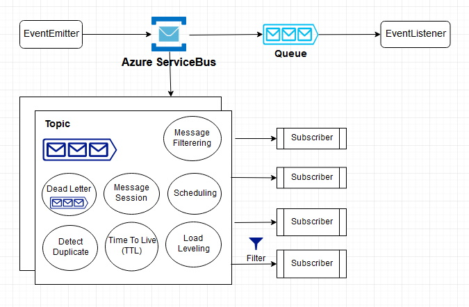

# Azure-ServiceBus
A simple demonstration of Azure SurviceBus. In this solution there are two console projects. One emits an event to a ServiceBus Topic, another receives event as a subscriber.

Fill in the necessary informations in *EventEmitter/Program.cs* 
```
private const string ServiceBusConnectionString = "topic_send_key_connection_string";
private const string TopicName = "topic_name";
```

Fill in the necessary informations in *EventSubscriber/Program.cs* 
```
private const string ServiceBusConnectionString = "topic_read_key_connection_string";
private const string TopicName = "topic_name";
private const string SubscriptionName = "subcription_name";
```


